# 🏪 SISTEMA POS - DOCUMENTACIÓN COMPLETA PARA ESTANDARIZACIÓN

## 📋 ÍNDICE

1. [Variables de Entorno](#variables-de-entorno)
2. [Modelo de Autenticación](#modelo-de-autenticación)
3. [Estructura de Base de Datos](#estructura-de-base-de-datos)
4. [Relaciones entre Tablas](#relaciones-entre-tablas)
5. [Validaciones de Caja](#validaciones-de-caja)
6. [Validaciones de Stock](#validaciones-de-stock)
7. [Validaciones de Ventas](#validaciones-de-ventas)
8. [Configuración de Supabase Storage](#configuración-de-supabase-storage)
9. [Arquitectura del Sistema](#arquitectura-del-sistema)
10. [Flujos de Negocio](#flujos-de-negocio)

---

## 🔧 VARIABLES DE ENTORNO

### **Variables Requeridas**

```bash
# Supabase Configuration
NEXT_PUBLIC_SUPABASE_URL=your_supabase_project_url
NEXT_PUBLIC_SUPABASE_ANON_KEY=your_supabase_anon_key
SUPABASE_URL=your_supabase_project_url
SUPABASE_SERVICE_ROLE_KEY=your_supabase_service_role_key

# Clerk Authentication
NEXT_PUBLIC_CLERK_PUBLISHABLE_KEY=your_clerk_publishable_key
CLERK_SECRET_KEY=your_clerk_secret_key
```

### **Configuración de Variables**

1. **Crear archivo `.env.local`** en la raíz del proyecto
2. **Obtener claves de Supabase:**
   - Ir a Dashboard de Supabase → Settings → API
   - Copiar `Project URL` y `anon public` key
   - Copiar `service_role` key (para Server Actions)

3. **Obtener claves de Clerk:**
   - Ir a Dashboard de Clerk → API Keys
   - Copiar `Publishable Key` y `Secret Key`

---

## 🔐 MODELO DE AUTENTICACIÓN

### **Arquitectura de Autenticación**

El sistema utiliza **Clerk** para autenticación y **Supabase** para almacenamiento de datos de usuario.

#### **Flujo de Autenticación:**

1. **Registro/Login:** Usuario se registra/inicia sesión en Clerk
2. **Sincronización:** El `clerk_user_id` se sincroniza con la tabla `usuarios` en Supabase
3. **Autorización:** Server Actions verifican permisos basados en el rol del usuario

#### **Roles de Usuario:**

```typescript
type UserRole = 'admin' | 'supervisor' | 'cobrador';
```

- **Admin:** Acceso completo a todas las funcionalidades
- **Supervisor:** Acceso a lectura y escritura (sin eliminación)
- **Cobrador:** Acceso limitado a ventas y caja

#### **Tabla de Usuarios:**

```sql
CREATE TABLE public.usuarios (
  id bigint GENERATED BY DEFAULT AS IDENTITY PRIMARY KEY,
  nombre text NOT NULL,
  email text UNIQUE NOT NULL,
  telefono text,
  password_hash text,
  rol text NOT NULL DEFAULT 'cobrador' CHECK (rol IN ('admin', 'supervisor', 'cobrador')),
  creado_el timestamp with time zone DEFAULT now(),
  prueba_gratis boolean DEFAULT true,
  clerk_user_id text UNIQUE
);
```

---

## 🗄️ ESTRUCTURA DE BASE DE DATOS

### **Tablas Principales**

#### **1. Configuración de Empresa**
```sql
CREATE TABLE public.configuracion (
  id bigint GENERATED BY DEFAULT AS IDENTITY PRIMARY KEY,
  creado_el timestamp with time zone DEFAULT now(),
  nombre text,
  imagen text
);
```

#### **2. Usuarios**
```sql
CREATE TABLE public.usuarios (
  id bigint GENERATED BY DEFAULT AS IDENTITY PRIMARY KEY,
  nombre text NOT NULL,
  email text UNIQUE NOT NULL,
  telefono text,
  password_hash text,
  rol text NOT NULL DEFAULT 'cobrador',
  creado_el timestamp with time zone DEFAULT now(),
  prueba_gratis boolean DEFAULT true,
  clerk_user_id text UNIQUE
);
```

#### **3. Entidades (Clientes/Proveedores)**
```sql
CREATE TABLE public.entidades (
  id bigint GENERATED BY DEFAULT AS IDENTITY PRIMARY KEY,
  razon_social text NOT NULL,
  tipo text NOT NULL CHECK (tipo IN ('cliente', 'proveedor')),
  email text,
  tipo_doc text CHECK (tipo_doc IN ('dni', 'cuit', 'cuil')),
  num_doc text,
  telefono text,
  categoria_iva text CHECK (categoria_iva IN ('Consumidor Final', 'Responsable Inscripto', 'Responsable Monotributo', 'Exento', 'No Responsable', 'Sujeto no Categorizado')),
  maximo_cuenta_corriente numeric(10,2)
);
```

#### **4. Artículos**
```sql
CREATE TABLE public.articulos (
  id bigint GENERATED BY DEFAULT AS IDENTITY PRIMARY KEY,
  descripcion text NOT NULL,
  precio_unitario numeric(10,2) NOT NULL,
  fk_id_agrupador bigint REFERENCES agrupadores(id),
  fk_id_marca bigint REFERENCES marcas(id),
  activo boolean DEFAULT true,
  stock numeric(10,2) DEFAULT 0
);
```

#### **5. Variantes de Artículos**
```sql
CREATE TABLE public.variantes_articulos (
  id bigint GENERATED BY DEFAULT AS IDENTITY PRIMARY KEY,
  creado_el timestamp with time zone DEFAULT now(),
  fk_id_articulo bigint REFERENCES articulos(id),
  stock_unitario integer DEFAULT 0,
  fk_id_talle bigint REFERENCES talles(id),
  fk_id_color bigint REFERENCES color(id)
);
```

#### **6. Cajas**
```sql
CREATE TABLE public.cajas (
  id bigint GENERATED BY DEFAULT AS IDENTITY PRIMARY KEY,
  descripcion text NOT NULL,
  turno text
);
```

#### **7. Lotes de Operaciones**
```sql
CREATE TABLE public.lotes_operaciones (
  id_lote bigint GENERATED BY DEFAULT AS IDENTITY PRIMARY KEY,
  fk_id_usuario bigint REFERENCES usuarios(id),
  fk_id_caja bigint REFERENCES cajas(id),
  abierto boolean DEFAULT true,
  tipo_lote text CHECK (tipo_lote IN ('apertura', 'cierre')),
  fecha_apertura timestamp with time zone DEFAULT now(),
  hora_apertura text,
  fecha_cierre timestamp with time zone,
  hora_cierre text,
  observaciones text,
  saldo_inicial numeric(10,2) DEFAULT 0
);
```

#### **8. Órdenes de Venta**
```sql
CREATE TABLE public.ordenes_venta (
  id bigint GENERATED BY DEFAULT AS IDENTITY PRIMARY KEY,
  fk_id_entidades bigint REFERENCES entidades(id),
  fk_id_usuario bigint REFERENCES usuarios(id),
  fk_id_lote bigint REFERENCES lotes_operaciones(id_lote),
  fk_id_tipo_comprobante bigint REFERENCES tipos_comprobantes(id),
  fecha timestamp with time zone DEFAULT now(),
  total numeric(10,2) NOT NULL,
  subtotal numeric(10,2) NOT NULL
);
```

#### **9. Detalles de Órdenes de Venta**
```sql
CREATE TABLE public.ordenes_venta_detalle (
  idd bigint GENERATED BY DEFAULT AS IDENTITY PRIMARY KEY,
  fk_id_orden bigint REFERENCES ordenes_venta(id),
  fk_id_articulo bigint REFERENCES articulos(id),
  cantidad integer NOT NULL,
  precio_unitario numeric(10,2) NOT NULL,
  fk_id_talle bigint REFERENCES talles(id),
  fk_id_color bigint REFERENCES color(id)
);
```

#### **10. Medios de Pago**
```sql
CREATE TABLE public.ordenes_venta_medios_pago (
  idd bigint GENERATED BY DEFAULT AS IDENTITY PRIMARY KEY,
  fk_id_orden bigint REFERENCES ordenes_venta(id),
  fk_id_cuenta_tesoreria bigint REFERENCES cuentas_tesoreria(id),
  monto_pagado numeric(10,2) NOT NULL
);
```

#### **11. Cuentas de Tesorería**
```sql
CREATE TABLE public.cuentas_tesoreria (
  id bigint GENERATED BY DEFAULT AS IDENTITY PRIMARY KEY,
  descripcion text NOT NULL,
  activo boolean DEFAULT true
);
```

#### **12. Movimientos de Stock**
```sql
CREATE TABLE public.movimientos_stock (
  id bigint GENERATED BY DEFAULT AS IDENTITY PRIMARY KEY,
  fk_id_articulos bigint REFERENCES articulos(id),
  fk_id_orden bigint REFERENCES ordenes_venta(id),
  origen text NOT NULL,
  tipo text NOT NULL,
  cantidad numeric(10,2),
  stock_actual numeric(10,2),
  creado_el timestamp with time zone DEFAULT now(),
  fk_id_talle bigint REFERENCES talles(id),
  fk_id_color bigint REFERENCES color(id)
);
```

#### **13. Cuentas Corrientes**
```sql
CREATE TABLE public.cuentas_corrientes (
  id bigint GENERATED BY DEFAULT AS IDENTITY PRIMARY KEY,
  creada_el timestamp with time zone DEFAULT now(),
  fk_id_orden bigint REFERENCES ordenes_venta(id),
  fk_id_cliente bigint REFERENCES entidades(id),
  total numeric(10,2) NOT NULL,
  saldo numeric(10,2) NOT NULL,
  estado text CHECK (estado IN ('pendiente', 'pagada', 'cancelado'))
);
```

#### **14. Pagos de Cuenta Corriente**
```sql
CREATE TABLE public.pagos_cuenta_corriente (
  id bigint GENERATED BY DEFAULT AS IDENTITY PRIMARY KEY,
  fk_id_cuenta_corriente bigint REFERENCES cuentas_corrientes(id),
  monto numeric(10,2) NOT NULL,
  fecha_pago timestamp with time zone DEFAULT now(),
  fk_id_usuario bigint REFERENCES usuarios(id),
  fk_id_lote bigint REFERENCES lotes_operaciones(id_lote)
);
```

#### **15. Detalles de Lotes de Operaciones**
```sql
CREATE TABLE public.detalle_lotes_operaciones (
  idd bigint GENERATED BY DEFAULT AS IDENTITY PRIMARY KEY,
  fk_id_lote bigint REFERENCES lotes_operaciones(id_lote),
  fk_id_cuenta_tesoreria bigint REFERENCES cuentas_tesoreria(id),
  tipo text CHECK (tipo IN ('ingreso', 'egreso')),
  monto numeric(10,2) NOT NULL,
  fecha_movimiento timestamp with time zone DEFAULT now()
);
```

#### **16. Tablas de Catálogo**

**Agrupadores:**
```sql
CREATE TABLE public.agrupadores (
  id bigint GENERATED BY DEFAULT AS IDENTITY PRIMARY KEY,
  nombre text NOT NULL,
  activo boolean DEFAULT true
);
```

**Marcas:**
```sql
CREATE TABLE public.marcas (
  id bigint GENERATED BY DEFAULT AS IDENTITY PRIMARY KEY,
  descripcion text NOT NULL,
  activo boolean DEFAULT true
);
```

**Colores:**
```sql
CREATE TABLE public.color (
  id bigint GENERATED BY DEFAULT AS IDENTITY PRIMARY KEY,
  descripcion text NOT NULL,
  activo boolean DEFAULT true
);
```

**Talles:**
```sql
CREATE TABLE public.talles (
  id bigint GENERATED BY DEFAULT AS IDENTITY PRIMARY KEY,
  descripcion text NOT NULL,
  activo boolean DEFAULT true
);
```

**Tipos de Comprobantes:**
```sql
CREATE TABLE public.tipos_comprobantes (
  id bigint GENERATED BY DEFAULT AS IDENTITY PRIMARY KEY,
  descripcion text NOT NULL,
  activo boolean DEFAULT true,
  reingresa_stock boolean DEFAULT false
);
```

**Tipos de Gasto:**
```sql
CREATE TABLE public.tipo_gasto (
  id bigint GENERATED BY DEFAULT AS IDENTITY PRIMARY KEY,
  descripcion text,
  obliga_empleado boolean,
  afecta_caja boolean
);
```

**Empleados:**
```sql
CREATE TABLE public.empleados (
  id bigint GENERATED BY DEFAULT AS IDENTITY PRIMARY KEY,
  nombre text NOT NULL,
  apellido text,
  telefono text,
  email text,
  activo boolean DEFAULT true
);
```

**Gastos de Empleados:**
```sql
CREATE TABLE public.gastos_empleados (
  id bigint GENERATED BY DEFAULT AS IDENTITY PRIMARY KEY,
  creado_el timestamp with time zone DEFAULT now(),
  fk_tipo_gasto bigint REFERENCES tipo_gasto(id),
  monto numeric(10,2) NOT NULL,
  descripcion text,
  fk_empleado bigint REFERENCES empleados(id),
  fk_lote_operaciones bigint REFERENCES lotes_operaciones(id_lote),
  fk_usuario bigint REFERENCES usuarios(id),
  fk_cuenta_tesoreria bigint REFERENCES cuentas_tesoreria(id)
);
```

**Liquidaciones:**
```sql
CREATE TABLE public.liquidaciones (
  id bigint GENERATED BY DEFAULT AS IDENTITY PRIMARY KEY,
  fk_id_empleado bigint REFERENCES empleados(id),
  fecha_inicio date NOT NULL,
  fecha_fin date NOT NULL,
  total_ventas numeric(10,2) DEFAULT 0,
  comision numeric(10,2) DEFAULT 0,
  total_liquidacion numeric(10,2) DEFAULT 0,
  estado text DEFAULT 'pendiente'
);
```

---

## 🔗 RELACIONES ENTRE TABLAS

### **Diagrama de Relaciones Principales**

```
usuarios (1) ←→ (N) lotes_operaciones
cajas (1) ←→ (N) lotes_operaciones
lotes_operaciones (1) ←→ (N) detalle_lotes_operaciones
lotes_operaciones (1) ←→ (N) gastos_empleados

entidades (1) ←→ (N) ordenes_venta
usuarios (1) ←→ (N) ordenes_venta
lotes_operaciones (1) ←→ (N) ordenes_venta
tipos_comprobantes (1) ←→ (N) ordenes_venta

ordenes_venta (1) ←→ (N) ordenes_venta_detalle
ordenes_venta (1) ←→ (N) ordenes_venta_medios_pago
ordenes_venta (1) ←→ (1) cuentas_corrientes

articulos (1) ←→ (N) ordenes_venta_detalle
articulos (1) ←→ (N) variantes_articulos
articulos (1) ←→ (N) movimientos_stock

agrupadores (1) ←→ (N) articulos
marcas (1) ←→ (N) articulos
talles (1) ←→ (N) variantes_articulos
color (1) ←→ (N) variantes_articulos

cuentas_tesoreria (1) ←→ (N) ordenes_venta_medios_pago
cuentas_tesoreria (1) ←→ (N) detalle_lotes_operaciones
cuentas_tesoreria (1) ←→ (N) gastos_empleados

empleados (1) ←→ (N) gastos_empleados
empleados (1) ←→ (N) liquidaciones
tipo_gasto (1) ←→ (N) gastos_empleados
```

### **Relaciones Clave**

1. **Lotes de Operaciones:** Central para control de caja
2. **Órdenes de Venta:** Núcleo del sistema de ventas
3. **Variantes:** Gestión de stock por talle/color
4. **Movimientos de Stock:** Trazabilidad completa

---

## 💰 VALIDACIONES DE CAJA

### **Apertura de Caja**

```typescript
// Validaciones implementadas
const validacionesAperturaCaja = {
  // 1. Validar prueba gratis
  pruebaGratis: async (usuarioId: number) => {
    const usuario = await getUsuarioById(usuarioId);
    if (usuario?.prueba_gratis) {
      const diasTranscurridos = calcularDiasDesdeCreacion(usuario.creado_el);
      if (diasTranscurridos > 15) {
        throw new Error('Período de prueba gratuito expirado');
      }
    }
  },

  // 2. Validar caja no abierta
  cajaNoAbierta: async () => {
    const loteAbierto = await getLoteAbierto();
    if (loteAbierto) {
      throw new Error('Ya hay una caja abierta');
    }
  },

  // 3. Validar datos requeridos
  datosRequeridos: (cajaId: number, saldoInicial: number, usuarioId: number) => {
    if (!cajaId || !saldoInicial || !usuarioId) {
      throw new Error('Todos los campos son obligatorios');
    }
  }
};
```

### **Cierre de Caja**

```typescript
// Validaciones implementadas
const validacionesCierreCaja = {
  // 1. Validar lote abierto
  loteAbierto: async (loteId: number) => {
    const lote = await getLoteById(loteId);
    if (!lote || !lote.abierto) {
      throw new Error('No hay un lote abierto para cerrar');
    }
  },

  // 2. Calcular movimientos
  calcularMovimientos: async (loteId: number) => {
    const movimientos = await getDetalleLotesOperaciones(loteId);
    const resumen = calcularResumenPorCuenta(movimientos);
    return resumen;
  },

  // 3. Generar reporte
  generarReporte: (resumen: any[]) => {
    return {
      fechaCierre: new Date(),
      resumenPorCuenta: resumen,
      totalIngresos: resumen.reduce((acc, c) => acc + c.ingresos, 0),
      totalEgresos: resumen.reduce((acc, c) => acc + c.egresos, 0)
    };
  }
};
```

### **Movimientos de Caja**

```typescript
// Tipos de movimientos
type TipoMovimiento = 'ingreso' | 'egreso';

// Validaciones de movimientos
const validacionesMovimientos = {
  // 1. Validar lote abierto
  loteAbierto: async (loteId: number) => {
    const lote = await getLoteById(loteId);
    if (!lote?.abierto) {
      throw new Error('No hay un lote abierto');
    }
  },

  // 2. Validar monto positivo
  montoPositivo: (monto: number) => {
    if (monto <= 0) {
      throw new Error('El monto debe ser mayor a 0');
    }
  },

  // 3. Validar cuenta de tesorería
  cuentaValida: async (cuentaId: number) => {
    const cuenta = await getCuentaTesoreriaById(cuentaId);
    if (!cuenta?.activo) {
      throw new Error('Cuenta de tesorería inválida');
    }
  }
};
```

---

## 📦 VALIDACIONES DE STOCK

### **Gestión de Stock por Variantes**

```typescript
// Validaciones de stock implementadas
const validacionesStock = {
  // 1. Validar stock disponible
  stockDisponible: async (articuloId: number, talleId: number, colorId: number, cantidad: number) => {
    const variante = await getVarianteByArticuloTalleColor(articuloId, talleId, colorId);
    if (!variante || variante.stock_unitario < cantidad) {
      throw new Error('Stock insuficiente');
    }
  },

  // 2. Actualizar stock al vender
  actualizarStockVenta: async (varianteId: number, cantidad: number) => {
    const variante = await getVarianteById(varianteId);
    const nuevoStock = variante.stock_unitario - cantidad;
    if (nuevoStock < 0) {
      throw new Error('Stock insuficiente');
    }
    await updateVariante(varianteId, { stock_unitario: nuevoStock });
  },

  // 3. Registrar movimiento de stock
  registrarMovimiento: async (data: {
    fk_id_articulos: number;
    fk_id_orden?: number;
    origen: string;
    tipo: 'entrada' | 'salida';
    cantidad: number;
    fk_id_talle?: number;
    fk_id_color?: number;
  }) => {
    await createMovimientoStock(data);
  }
};
```

### **Tipos de Origen de Movimientos**

```typescript
type OrigenMovimiento = 
  | 'FACTURA'      // Venta
  | 'AJUSTE'       // Ajuste manual
  | 'COMPRA'       // Compra a proveedor
  | 'DEVOLUCION'   // Devolución de cliente
  | 'TRANSFERENCIA'; // Transferencia entre depósitos
```

### **Cálculo de Stock Total**

```typescript
// Cálculo automático de stock total por artículo
const calcularStockTotal = async (articuloId: number) => {
  const variantes = await getVariantesByArticulo(articuloId);
  const stockTotal = variantes.reduce((acc, v) => acc + (v.stock_unitario || 0), 0);
  await updateArticle(articuloId, { stock: stockTotal });
  return stockTotal;
};
```

---

## 🛒 VALIDACIONES DE VENTAS

### **Validaciones Pre-Venta**

```typescript
// Validaciones implementadas en venta-form-dialog.tsx
const validacionesVenta = {
  // 1. Validar prueba gratis
  pruebaGratis: async (usuarioId: number) => {
    const usuario = await getUsuarioById(usuarioId);
    if (usuario?.prueba_gratis) {
      const diasTranscurridos = calcularDiasDesdeCreacion(usuario.creado_el);
      if (diasTranscurridos > 15) {
        throw new Error('Período de prueba gratuito expirado');
      }
    }
  },

  // 2. Validar lote abierto
  loteAbierto: async (usuarioId: number) => {
    const lote = await getLoteCajaAbiertaPorUsuario(usuarioId);
    if (!lote || !lote.abierto) {
      throw new Error('Debe haber una caja abierta para registrar la venta');
    }
    return lote;
  },

  // 3. Validar medios de pago
  mediosPago: (mediosPago: any[]) => {
    if (!mediosPago || mediosPago.length === 0) {
      throw new Error('Debe seleccionar al menos un medio de pago');
    }
    
    const totalMediosPago = mediosPago.reduce((acc, m) => acc + m.monto, 0);
    if (totalMediosPago <= 0) {
      throw new Error('El monto total de medios de pago debe ser mayor a 0');
    }
  },

  // 4. Validar cuenta corriente
  cuentaCorriente: async (clienteId: number, total: number) => {
    const cliente = await getClienteById(clienteId);
    if (clienteId === 1) { // Consumidor Final
      throw new Error('No se puede usar cuenta corriente con Consumidor Final');
    }
    
    if (cliente?.maximo_cuenta_corriente && total > cliente.maximo_cuenta_corriente) {
      throw new Error(`El total supera el máximo permitido para cuenta corriente`);
    }
  },

  // 5. Validar stock disponible
  stockDisponible: async (detalle: any[]) => {
    for (const item of detalle) {
      if (item.talle && item.color) {
        const variante = await getVarianteByArticuloTalleColor(
          item.articulo.id, 
          item.talle, 
          item.color
        );
        if (!variante || variante.stock_unitario < item.cantidad) {
          throw new Error(`Stock insuficiente para ${item.articulo.descripcion}`);
        }
      }
    }
  }
};
```

### **Proceso de Venta**

```typescript
// Flujo completo de venta
const procesoVenta = async (datosVenta: any) => {
  // 1. Crear orden de venta
  const ordenVenta = await createOrdenVenta({
    fk_id_entidades: datosVenta.clienteId,
    fk_id_usuario: datosVenta.usuarioId,
    fk_id_lote: datosVenta.loteId,
    fk_id_tipo_comprobante: datosVenta.tipoComprobanteId,
    fecha: new Date(),
    total: datosVenta.total,
    subtotal: datosVenta.subtotal
  });

  // 2. Crear detalles de venta
  for (const detalle of datosVenta.detalle) {
    await createOrdenVentaDetalle({
      fk_id_orden: ordenVenta.id,
      fk_id_articulo: detalle.articuloId,
      cantidad: detalle.cantidad,
      precio_unitario: detalle.precio,
      fk_id_talle: detalle.talleId,
      fk_id_color: detalle.colorId
    });

    // 3. Actualizar stock
    if (detalle.talleId && detalle.colorId) {
      const variante = await getVarianteByArticuloTalleColor(
        detalle.articuloId, 
        detalle.talleId, 
        detalle.colorId
      );
      await updateVariante(variante.id, {
        stock_unitario: variante.stock_unitario - detalle.cantidad
      });
    }

    // 4. Registrar movimiento de stock
    await createMovimientoStock({
      fk_id_orden: ordenVenta.id,
      fk_id_articulos: detalle.articuloId,
      origen: 'FACTURA',
      tipo: 'salida',
      cantidad: -detalle.cantidad,
      fk_id_talle: detalle.talleId,
      fk_id_color: detalle.colorId
    });
  }

  // 5. Crear medios de pago
  for (const medioPago of datosVenta.mediosPago) {
    await createOrdenVentaMediosPago({
      fk_id_orden: ordenVenta.id,
      fk_id_cuenta_tesoreria: medioPago.cuentaId,
      monto_pagado: medioPago.monto
    });

    // 6. Registrar movimiento de caja (excepto cuenta corriente)
    if (!medioPago.esCuentaCorriente) {
      await registrarMovimientoCaja({
        fk_id_lote: datosVenta.loteId,
        fk_id_cuenta_tesoreria: medioPago.cuentaId,
        tipo: 'ingreso',
        monto: medioPago.monto
      });
    }
  }

  // 7. Crear cuenta corriente si corresponde
  if (datosVenta.tieneCuentaCorriente) {
    await createCuentaCorriente({
      fk_id_orden: ordenVenta.id,
      fk_id_cliente: datosVenta.clienteId,
      total: datosVenta.total,
      saldo: datosVenta.total,
      estado: 'pendiente'
    });
  }
};
```

---

## 🗂️ CONFIGURACIÓN DE SUPABASE STORAGE

### **Crear Bucket para Imágenes**

#### **1. Desde Dashboard de Supabase:**

1. Ir a **Storage** en el dashboard
2. Click en **"New bucket"**
3. Configurar:
   - **Name:** `logos`
   - **Public bucket:** ✅ Marcado
   - **File size limit:** 5MB
   - **Allowed MIME types:** `image/*`

#### **2. Configurar Políticas RLS:**

```sql
-- Política para lectura pública de logos
CREATE POLICY "Logos públicos" ON storage.objects
FOR SELECT USING (bucket_id = 'logos');

-- Política para subida de logos (solo admin)
CREATE POLICY "Subida de logos" ON storage.objects
FOR INSERT WITH CHECK (
  bucket_id = 'logos' 
  AND auth.role() = 'authenticated'
);
```

#### **3. Implementación en Código:**

```typescript
// src/app/actions/configuracion.ts
export async function uploadLogoEmpresa(file: File) {
  const usuario = await checkUserPermissions();
  
  if (usuario.rol !== 'admin') {
    throw new Error('No tienes permisos para subir el logo de la empresa');
  }
  
  // Subir archivo
  const { data, error } = await supabase.storage
    .from('logos')
    .upload(`${Date.now()}-${file.name}`, file);
    
  if (error) throw error;
  
  // Obtener URL pública
  const { data: urlData } = supabase.storage
    .from('logos')
    .getPublicUrl(data.path);
    
  return urlData.publicUrl;
}
```

#### **4. Componente de Subida:**

```typescript
// src/components/configuracion/logo-upload.tsx
const handleFileUpload = async (file: File) => {
  try {
    const url = await uploadLogoEmpresa(file);
    await updateConfiguracionEmpresa({ imagen: url });
    showToast('Logo actualizado exitosamente');
  } catch (error) {
    showToast('Error al subir el logo', 'error');
  }
};
```

---

## 🏗️ ARQUITECTURA DEL SISTEMA

### **Estructura de Carpetas**

```
src/
├── app/
│   ├── actions/           # Server Actions (Backend)
│   ├── caja/             # Página de gestión de caja
│   ├── articles/         # Página de artículos
│   ├── ventas/           # Página de ventas
│   └── ...               # Otras páginas
├── components/
│   ├── ui/               # Componentes base (shadcn/ui)
│   ├── articles/         # Componentes de artículos
│   ├── ventas/           # Componentes de ventas
│   └── ...               # Otros componentes
├── hooks/
│   ├── use-*-secure.ts   # Hooks seguros con Server Actions
│   └── ...               # Otros hooks
├── types/                # Definiciones TypeScript
├── lib/                  # Utilidades y configuración
└── services/             # ⚠️ DEPRECATED (usar Server Actions)
```

### **Patrón de Arquitectura**

```
Frontend (Next.js) → Server Actions → Supabase Database
     ↓                    ↓              ↓
  React Hooks    →   Clerk Auth   →   PostgreSQL
     ↓                    ↓              ↓
  UI Components  →   RBAC Logic   →   Row Level Security
```

### **Flujo de Datos Seguro**

1. **Autenticación:** Clerk maneja login/registro
2. **Autorización:** Server Actions verifican permisos
3. **Validación:** Zod schemas validan datos
4. **Persistencia:** Supabase con RLS
5. **Respuesta:** Datos filtrados por permisos

---

## 🔄 FLUJOS DE NEGOCIO

### **Flujo de Venta Completo**

```mermaid
graph TD
    A[Cliente llega] --> B[Abrir caja]
    B --> C[Seleccionar artículos]
    C --> D[Validar stock]
    D --> E[Calcular total]
    E --> F[Seleccionar medios de pago]
    F --> G[Validar cuenta corriente]
    G --> H[Crear orden de venta]
    H --> I[Actualizar stock]
    I --> J[Registrar movimientos de caja]
    J --> K[Generar comprobante]
    K --> L[Cerrar venta]
```



### **Flujo de Gestión de Caja**


### **Flujo de Gestión de Stock**

```mermaid
graph TD
    A[Crear artículo] --> B[Definir variantes]
    B --> C[Establecer stock inicial]
    C --> D[Venta]
    D --> E[Validar stock disponible]
    E --> F[Descontar stock]
    F --> G[Registrar movimiento]
    G --> H[Actualizar stock total]
```



---

## 📊 REPORTES Y CONSULTAS

### **Reportes Disponibles**

1. **Cierre de Caja:** Resumen de movimientos por cuenta
2. **Ventas por Período:** Análisis de ventas
3. **Stock por Artículo:** Estado de inventario
4. **Cuentas Corrientes:** Saldos pendientes
5. **Liquidaciones:** Comisiones por empleado

### **Consultas Principales**

```sql
-- Stock total por artículo
SELECT 
  a.descripcion,
  COALESCE(SUM(v.stock_unitario), 0) as stock_total
FROM articulos a
LEFT JOIN variantes_articulos v ON a.id = v.fk_id_articulo
WHERE a.activo = true
GROUP BY a.id, a.descripcion;

-- Ventas por período
SELECT 
  DATE(ov.fecha) as fecha,
  COUNT(*) as cantidad_ventas,
  SUM(ov.total) as total_ventas
FROM ordenes_venta ov
WHERE ov.fecha BETWEEN $1 AND $2
GROUP BY DATE(ov.fecha)
ORDER BY fecha;

-- Movimientos de caja por lote
SELECT 
  ct.descripcion as cuenta,
  SUM(CASE WHEN dlo.tipo = 'ingreso' THEN dlo.monto ELSE 0 END) as ingresos,
  SUM(CASE WHEN dlo.tipo = 'egreso' THEN dlo.monto ELSE 0 END) as egresos
FROM detalle_lotes_operaciones dlo
JOIN cuentas_tesoreria ct ON dlo.fk_id_cuenta_tesoreria = ct.id
WHERE dlo.fk_id_lote = $1
GROUP BY ct.id, ct.descripcion;
```

---

## 🚀 DEPLOYMENT Y CONFIGURACIÓN

### **Requisitos del Sistema**

- **Node.js:** 18.x o superior
- **Next.js:** 15.x
- **Supabase:** Proyecto configurado
- **Clerk:** Aplicación configurada

### **Pasos de Instalación**

1. **Clonar repositorio**
2. **Instalar dependencias:** `npm install`
3. **Configurar variables de entorno**
4. **Ejecutar migraciones de base de datos**
5. **Configurar Clerk y Supabase**
6. **Iniciar desarrollo:** `npm run dev`

### **Comandos de Build**

```bash
# Desarrollo
npm run dev

# Build de producción
npm run build

# Iniciar producción
npm start

# Linting
npm run lint
```

---

## 📝 NOTAS IMPORTANTES

### **Seguridad**

- ✅ **Server Actions** para todas las operaciones de BD
- ✅ **Autenticación Clerk** obligatoria
- ✅ **Control de permisos** por rol
- ✅ **Validación de datos** con Zod
- ✅ **Claves sensibles** ocultas del frontend

### **Performance**

- ✅ **Optimización de consultas** con índices
- ✅ **Caching** de datos estáticos
- ✅ **Lazy loading** de componentes
- ✅ **Paginación** en listas grandes

### **Mantenibilidad**

- ✅ **TypeScript** para tipado fuerte
- ✅ **Componentes reutilizables**
- ✅ **Hooks personalizados**
- ✅ **Documentación completa**

---

## 🎯 CONCLUSIÓN

Este sistema POS está diseñado para ser **escalable, seguro y fácil de mantener**. La arquitectura basada en Server Actions garantiza que todas las operaciones críticas se ejecuten en el servidor con autenticación y autorización apropiadas.

**Características clave:**
- 🔐 **Seguridad total** con Clerk + Server Actions
- 💰 **Gestión completa de caja** con lotes de operaciones
- 📦 **Control de stock** por variantes (talle/color)
- 🛒 **Sistema de ventas** robusto con validaciones
- 📊 **Reportes y análisis** integrados
- 🎨 **Interfaz moderna** con shadcn/ui

**El sistema está listo para producción y puede ser replicado en múltiples ubicaciones manteniendo la consistencia de datos y seguridad.** 